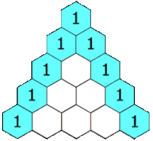

# Pascal's Triangle 

<span style="font-family:arial; font-size:2em;">
Compute Pascal's triangle up to a given number of rows. 
In Pascal's Triangle each number is computed by adding the numbers to 
the right and left of the current position in the previous row.
</span>

 


````
1
1 1
1 2 1
1 3 3 1
1 4 6 4 1 
````

````
0 - 1
1 - 1 1
2 - 1 2 1
3 - 1 3 3 1
4 - 1 4 6 4 1 
````